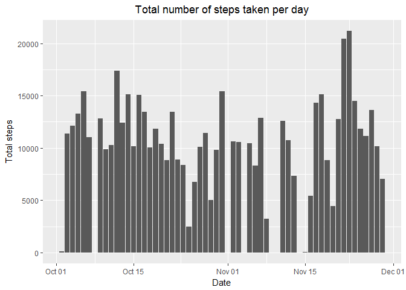
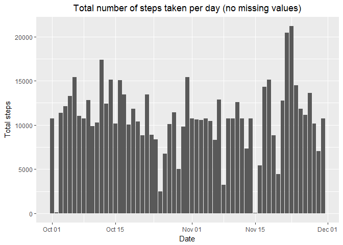
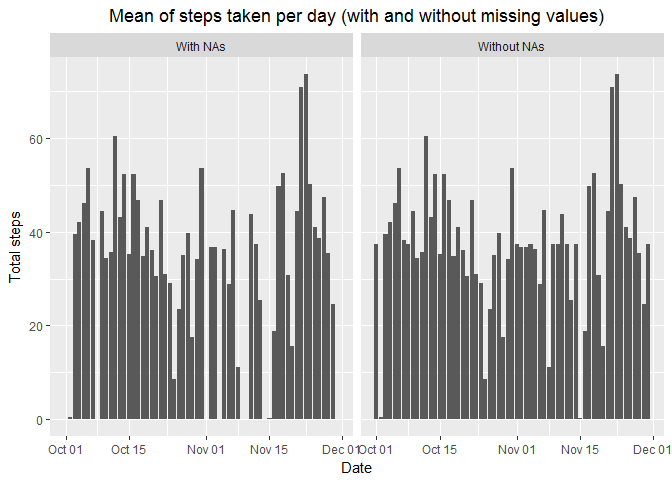
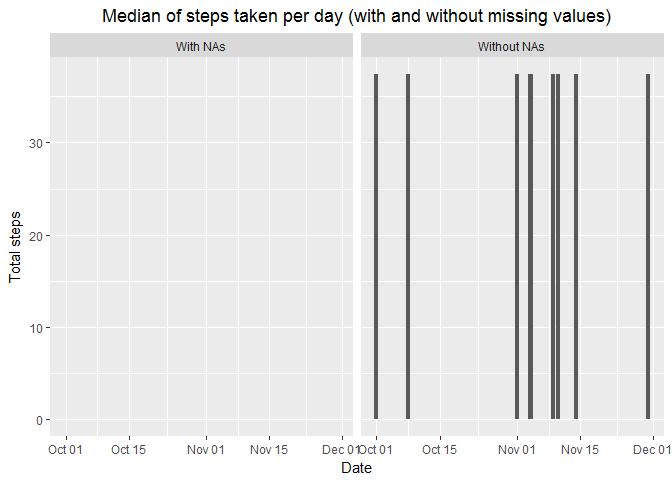
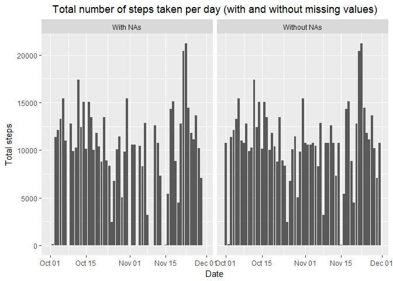
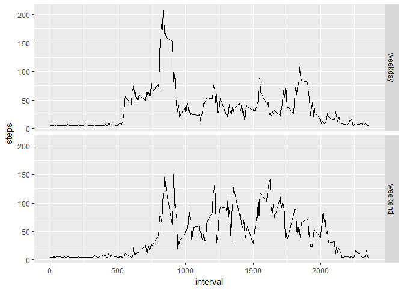

## Loading and preprocessing the data

### Sub-task 1: Loading the data

In case we want to download and unzip the data, here's the necessary code:

```r
destfile<-"./Activity.zip"
url<-"https://d396qusza40orc.cloudfront.net/repdata%2Fdata%2Factivity.zip"
if(!file.exists("./Activity.zip")){download.file(url = url, destfile = destfile)}
unzip(destfile)
```

We will load the data into R using the read.csv function:

```r
activity<-read.csv("./activity.csv")
```

Let's take a closer look at the data:

```r
head(activity)
```

```
##   steps       date interval
## 1    NA 2012-10-01        0
## 2    NA 2012-10-01        5
## 3    NA 2012-10-01       10
## 4    NA 2012-10-01       15
## 5    NA 2012-10-01       20
## 6    NA 2012-10-01       25
```

```r
str(activity)
```

```
## 'data.frame':	17568 obs. of  3 variables:
##  $ steps   : int  NA NA NA NA NA NA NA NA NA NA ...
##  $ date    : Factor w/ 61 levels "2012-10-01","2012-10-02",..: 1 1 1 1 1 1 1 1 1 1 ...
##  $ interval: int  0 5 10 15 20 25 30 35 40 45 ...
```

### Subtask 2: Preprocessing/processing/transforming the data

The only transformation to be performed is to change the format of the dates in the dataset

```r
activity$date <- as.POSIXct(activity$date, "%Y-%m-%d", tz = "GMT")
```

## What is mean total number of steps taken per day?

### Subtask 1: Calculate the total number of steps taken per day

There are multiple ways of calculating the total number of steps per day. One of them is by using the dplyr package. It is loaded with the following code:

```r
library(dplyr)
```

Next, let's summarize and view the results:

```r
steps_per_day <- summarise(group_by(activity, date), total_steps=sum(steps))
steps_per_day
```

```
## # A tibble: 61 x 2
##    date                total_steps
##    <dttm>                    <int>
##  1 2012-10-01 00:00:00          NA
##  2 2012-10-02 00:00:00         126
##  3 2012-10-03 00:00:00       11352
##  4 2012-10-04 00:00:00       12116
##  5 2012-10-05 00:00:00       13294
##  6 2012-10-06 00:00:00       15420
##  7 2012-10-07 00:00:00       11015
##  8 2012-10-08 00:00:00          NA
##  9 2012-10-09 00:00:00       12811
## 10 2012-10-10 00:00:00        9900
## # ... with 51 more rows
```

### Subtask 2: Make a histogram of the total number of steps taken each day

All plots in the current analysis will be created using the ggplot2 package. Code for loading the ggplot2 package:


```r
library(ggplot2)
```

Let's create a histogram with the toal number of steps taken per day:


```r
g<-ggplot(steps_per_day, aes(x=date, y=total_steps))
g+geom_histogram(stat = "identity")+labs(title = "Total number of steps taken per day", x="Date", y = "Total steps")+theme(plot.title = element_text(hjust = 0.5))
```

<!-- -->

### Subtask 3: Calculate and report the mean and median of the total number of steps taken per day

The calculation of mean and median of the total number of steps taken per day would also be made by using the dplyr package function summarise:


```r
steps_per_day_mm <- summarise(group_by(activity, date), total_steps=sum(steps), mean=mean(steps), median=median(steps))
steps_per_day_mm
```

```
## # A tibble: 61 x 4
##    date                total_steps   mean median
##    <dttm>                    <int>  <dbl>  <dbl>
##  1 2012-10-01 00:00:00          NA NA        NA 
##  2 2012-10-02 00:00:00         126  0.438     0.
##  3 2012-10-03 00:00:00       11352 39.4       0.
##  4 2012-10-04 00:00:00       12116 42.1       0.
##  5 2012-10-05 00:00:00       13294 46.2       0.
##  6 2012-10-06 00:00:00       15420 53.5       0.
##  7 2012-10-07 00:00:00       11015 38.2       0.
##  8 2012-10-08 00:00:00          NA NA        NA 
##  9 2012-10-09 00:00:00       12811 44.5       0.
## 10 2012-10-10 00:00:00        9900 34.4       0.
## # ... with 51 more rows
```


## What is the average daily activity pattern?

### Subtask 1: Make a time series plot (i.e. type=="l") of the 5-minute interval (x-axis) and the average number of steps taken, averaged across all day

For this task, we will use the aggregate function and then plot the results using the ggplot2 package.


```r
pattern<-aggregate(steps~interval, data=activity, FUN=mean)
g2<-ggplot(pattern, aes(x=interval, y=steps))
g2+geom_line()
```

<!-- -->

### Subtask 3: Which 5-minute interval, on average across all the days in the dataset, contains the maximum number of steps?

A subset of the data is created in order to show the interval with the highest number of avg steps

```r
pattern[which.max(pattern$steps),]
```

```
##     interval    steps
## 104      835 206.1698
```


## Imputing missing values

### Subtask 4: Calculate and report the total number of missing values in the dataset (i.e. the total number of rows with NAs)

This task will be solved using the following code:


```r
sum(is.na(activity))
```

```
## [1] 2304
```

### Subtask 2: Devise a strategy for filling in all of the missing values in the dataset. The strategy does not need to be sophisticated. For example, you could use the mean/median for that day, or the mean for that 5-minute interval, etc.

In order to replace the missing values in the original dataset, the following strategy is used: all missing values in the "steps" column will be replaced by the mean value of the total amount of steps for whole dataset.

### Subtask 3: Create a new dataset that is equal to the original dataset but with the missing data filled in.

First of all a duplicate of the original dataset is created.


```r
activity2<-activity
```

In order to perform the strategy described in the previous subtask above, we shall calculate the mean of the total number of steps and use a 'for' function as follows:


```r
total_mean<-mean(activity2$steps, na.rm = TRUE)

for (x in 1:nrow(activity2)){
  if(is.na(activity2$steps[x])==TRUE){
    activity2$steps[x]<-total_mean
    }
}
```

Now let's confirm that there are 0 missing values in the new dataset.


```r
sum(is.na(activity2))
```

```
## [1] 0
```


### Subtask 4: Make a histogram of the total number of steps taken each day and Calculate and report the mean and median total number of steps taken per day. Do these values differ from the estimates from the first part of the assignment? What is the impact of imputing missing data on the estimates of the total daily number of steps?

In order to make a histogram of the total number of steps taken each day, we'll use the summarise function and then the ggplot2 package to plot the results.


```r
steps_per_day_no_na <- summarise(group_by(activity2, date), steps=sum(steps))

g3<-ggplot(steps_per_day_no_na, aes(x=date,y=steps))
g3+geom_histogram(stat = "identity")+labs(title = "Total number of steps taken per day (no missing values)", x="Date", y = "Total steps")+theme(plot.title = element_text(hjust = 0.5))
```

<!-- -->

The calculation of the mean and would also be obtained using the summarise function. The result is printed afterwards.


```r
steps_per_day_mm_no_na <- summarise(group_by(activity2, date), total_steps=sum(steps), mean=mean(steps), median=median(steps))
steps_per_day_mm_no_na
```

```
## # A tibble: 61 x 4
##    date                total_steps   mean median
##    <dttm>                    <dbl>  <dbl>  <dbl>
##  1 2012-10-01 00:00:00      10766. 37.4     37.4
##  2 2012-10-02 00:00:00        126.  0.438    0. 
##  3 2012-10-03 00:00:00      11352. 39.4      0. 
##  4 2012-10-04 00:00:00      12116. 42.1      0. 
##  5 2012-10-05 00:00:00      13294. 46.2      0. 
##  6 2012-10-06 00:00:00      15420. 53.5      0. 
##  7 2012-10-07 00:00:00      11015. 38.2      0. 
##  8 2012-10-08 00:00:00      10766. 37.4     37.4
##  9 2012-10-09 00:00:00      12811. 44.5      0. 
## 10 2012-10-10 00:00:00       9900. 34.4      0. 
## # ... with 51 more rows
```

To check whether these values differ from the estimates from the first part of the assignment we will add comments to the two summary tables and assign the results as new datasets:


```r
with_na<-mutate(steps_per_day_mm, comment=c("With NAs"))
without_na<-mutate(steps_per_day_mm_no_na, comment=c("Without NAs"))
```

Both tables are put together with the rbind function:


```r
both<-rbind(with_na, without_na)
```

Now let's compare the mean using the ggplot package:


```r
g4<-ggplot(both, aes(x=date, y=mean))
g4+geom_histogram(stat = "identity")+labs(title = "Mean of steps taken per day (with and without missing values)", x="Date", y = "Total steps")+theme(plot.title = element_text(hjust = 0.5))+facet_grid(.~comment)
```

<!-- -->

It can be observed that the mean values within the dataset without missing values are much higher than the ones with missing values.

Analogically we can compare the values of the median for both datasets


```r
g5<-ggplot(both, aes(x=date, y=median))
g5+geom_histogram(stat = "identity")+labs(title = "Median of steps taken per day (with and without missing values)", x="Date", y = "Total steps")+theme(plot.title = element_text(hjust = 0.5))+facet_grid(.~comment)
```

<!-- -->

As the plot on the right shows, the median for the days that have only missing values is changed and is now equal to the total mean of steps per day.

To see What the impact of imputing missing data is on the estimates of the total daily number of steps first we calculate the total number of steps. The "na.rm=TRUE" must be introduced to avoid error in the calculation.


```r
sum(with_na$total_steps, na.rm = TRUE)
```

```
## [1] 570608
```

Now we do the same for the database with the missing values replaced (this time "na.rm=TRUE" is not necessary:


```r
sum(without_na$total_steps)
```

```
## [1] 656737.5
```

We can see that the total amount of steps is higher for the database with the missing values replaced. Let's also plot the result in order to visualise the difference using the ggplot2 package:


```r
g6<-ggplot(both, aes(x=date, y=total_steps))
g6+geom_histogram(stat = "identity")+labs(title = "Total number of steps taken per day (with and without missing values)", x="Date", y = "Total steps")+theme(plot.title = element_text(hjust = 0.5))+facet_grid(.~comment)
```

<!-- -->

## Are there differences in activity patterns between weekdays and weekends?
### Subtask 1: Create a new factor variable in the dataset with two levels - "weekday" and "weekend" indicating whether a given date is a weekday or weekend day.

We'll create a copy of the dataset used in part 4


```r
activity3<-activity2
```

Next we'll create a factor variable in the dataset and assign to it two levels - weekday and weekend:


```r
activity3$day <- factor(format(activity3$date, "%A"))
levels(activity3$day) <- list(weekday=c("Monday","Tuesday","Wednesday","Thursday","Friday"), weekend=c("Saturday", "Sunday"))
```

### Subtask 2: Make a panel plot containing a time series plot of the 5-minute interval (x-axis) and the average number of steps taken, averaged across all weekday days or weekend days (y-axis). See the README file in the GitHub repository to see an example of what this plot should look like using simulated data.

For this task, first an aggregation should be made:


```r
day_pattern<-aggregate(steps~interval+day, data=activity3, FUN=mean)
```

As in the previous parts, the ggplot2 package will be used for creating the plots.


```r
g6<-ggplot(day_pattern, aes(x=interval, y=steps))
g6+geom_line()+facet_grid(day~.)
```

<!-- -->
